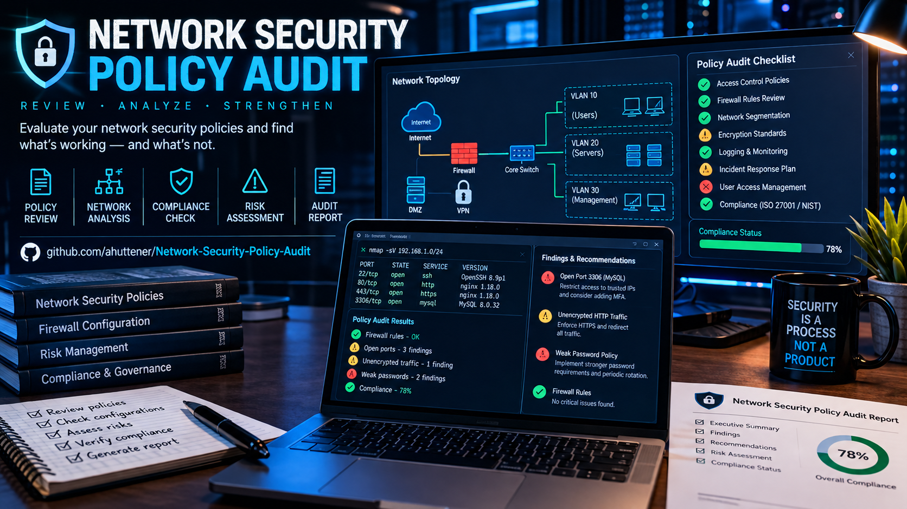
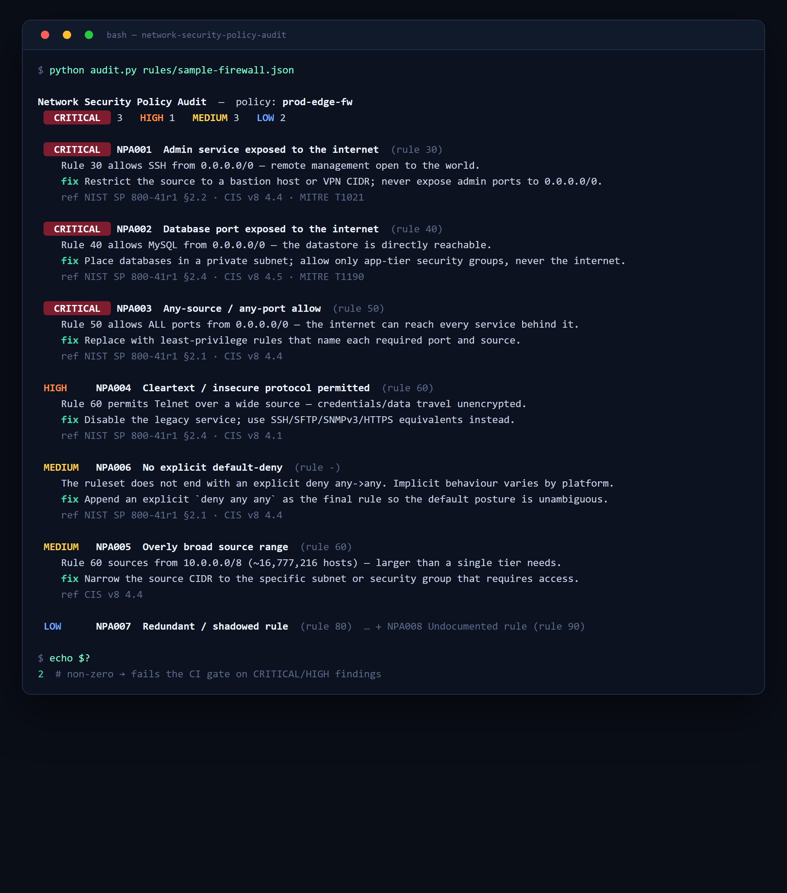

<p align="center">
  
</p>

<p align="center">
  
  
  
  
  
</p>

<p align="center">
  <b>A CLI that audits a firewall / network-policy ruleset against best practice</b> — flags risky rules, maps each to NIST 800-41 & CIS v8, and fails your CI when a change introduces exposure.
</p>

---

## 👋 About

I'm **Adriano Huttener**. This is a small, dependency-free **network policy auditor**: point it at a ruleset (JSON) and it reports prioritised findings with concrete remediation — the kind of automated check that belongs in a change-management pipeline so a risky firewall change never reaches production unnoticed.

> 🇮🇪 Based in Kildare, Ireland · Open to security roles

---

## 🖥️ Example run

<p align="center">
  
</p>

Run against the included sample:

```bash
python audit.py rules/sample-firewall.json
```

---

## 🔎 What it checks

| ID | Severity | Check | Reference |
|----|----------|-------|-----------|
| `NPA001` | Critical | Admin service (SSH/RDP/WinRM/Telnet) exposed to the internet | NIST 800-41 · CIS 4.4 · MITRE T1021 |
| `NPA002` | Critical | Database port exposed to the internet | NIST 800-41 · CIS 4.5 · MITRE T1190 |
| `NPA003` | Critical | Any-source / any-port allow from the internet | NIST 800-41 · CIS 4.4 |
| `NPA004` | High | Cleartext / insecure protocol (FTP, Telnet, TFTP, SNMP…) over a wide source | NIST 800-41 · CIS 4.1 |
| `NPA005` | Medium | Overly broad source range (e.g. a `/8`) | CIS 4.4 |
| `NPA006` | Medium | No explicit default-deny at the end of the policy | NIST 800-41 · CIS 4.4 |
| `NPA007` | Low | Redundant / shadowed rule | NIST 800-41 §4.1 |
| `NPA008` | Low | Undocumented rule (no description / owner) | CIS 4.2 |

---

## 🚀 Usage

```bash
python audit.py rules/sample-firewall.json          # human-readable report
python audit.py rules/sample-firewall.json --json   # machine-readable (pipe to jq)
python audit.py rules/new.json --baseline rules/approved-baseline.json   # flag rules added since the approved set
```

**Exit codes** make it a drop-in CI gate:

| Code | Meaning |
|:----:|---------|
| `0` | clean |
| `1` | only medium/low findings |
| `2` | at least one **critical/high** finding — fail the build |

```yaml
# .github/workflows/policy-audit.yml
- name: Audit firewall policy
  run: python audit.py rules/prod-edge-fw.json --baseline rules/approved-baseline.json
```

---

## 📄 Ruleset format

A ruleset is plain JSON — export from your firewall, security groups or IaC and normalise to:

```json
{
  "policy": "prod-edge-fw",
  "rules": [
    { "id": 10, "action": "allow", "src": "0.0.0.0/0", "dst": "10.0.1.10", "port": "443", "proto": "tcp", "desc": "Public HTTPS", "owner": "web-team" }
  ]
}
```

`port` accepts a number, a range (`8000-8100`), a list (`80,443`) or `any`. See [`rules/`](rules/) for a full sample and an approved baseline.

---

## ⚠️ Disclaimer

For **education and defensive use**. Findings are heuristic best-practice checks, not a substitute for a full firewall review. Audit only policies you are authorised to assess.

---

<p align="center">🛡️ <a href="https://cybersecinfo.com">cybersecinfo.com</a> · 👤 <a href="https://github.com/ahuttener">github.com/ahuttener</a></p>
